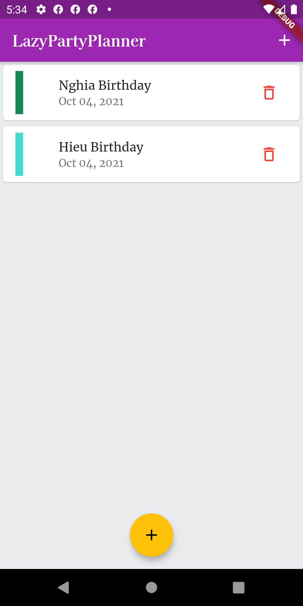
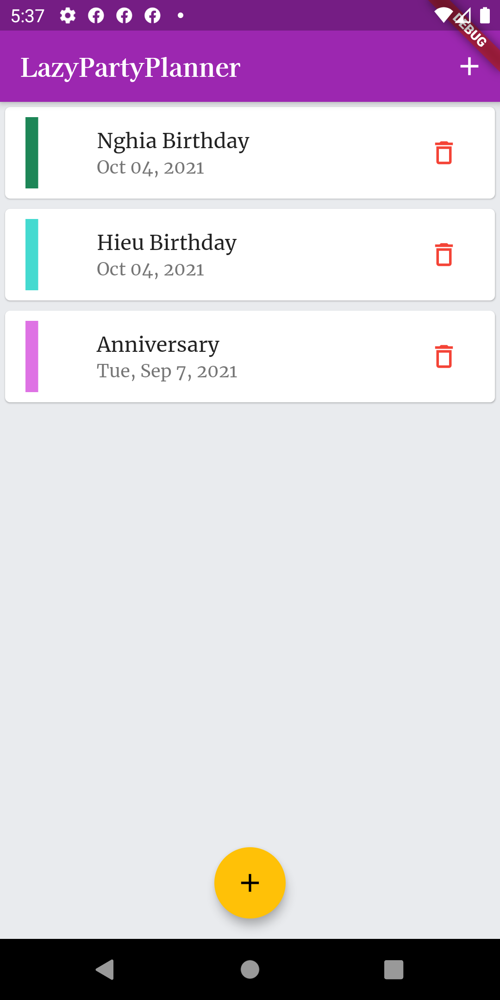
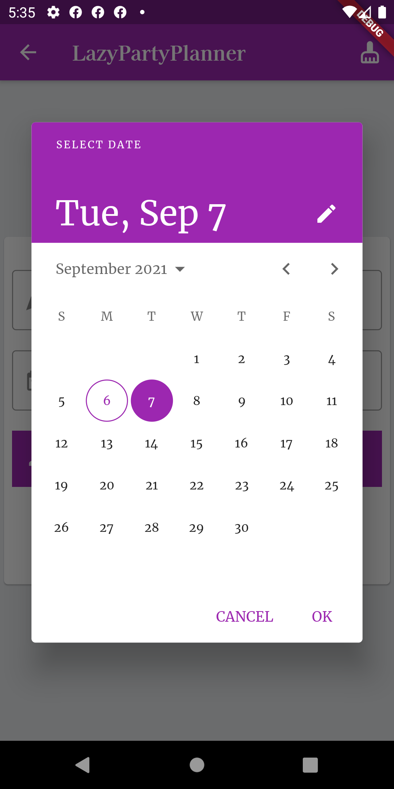
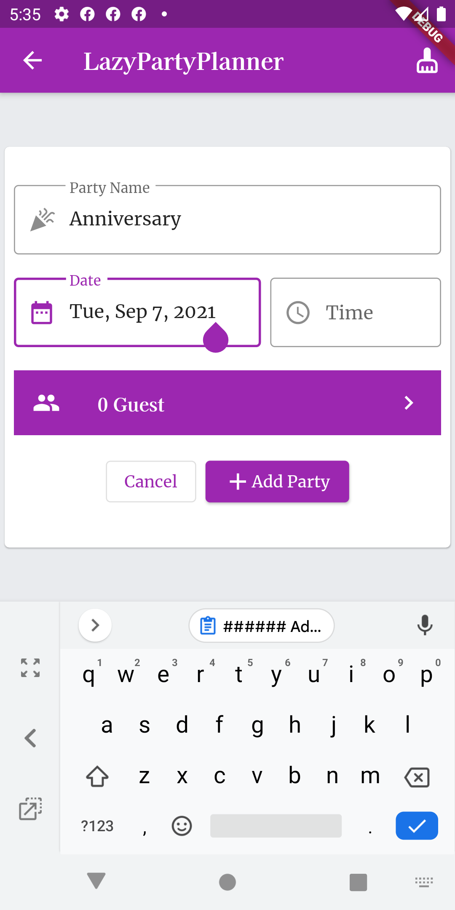
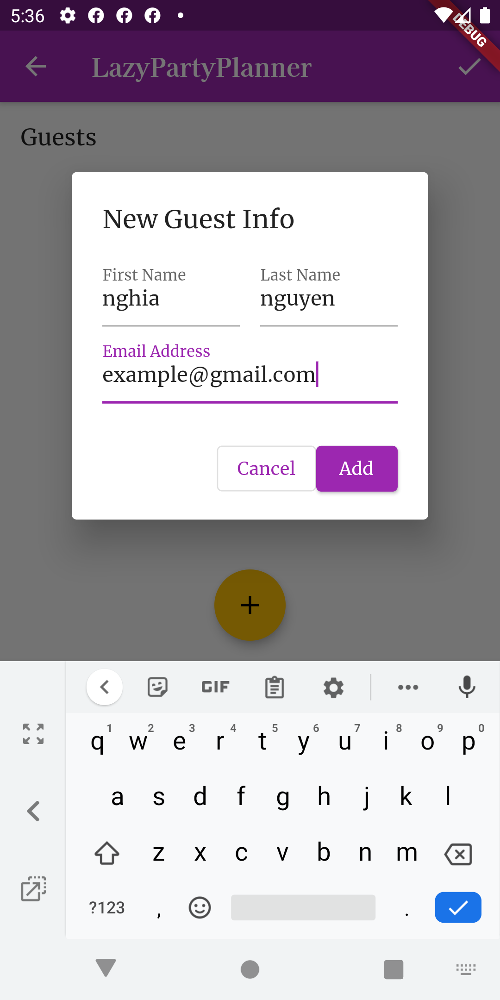
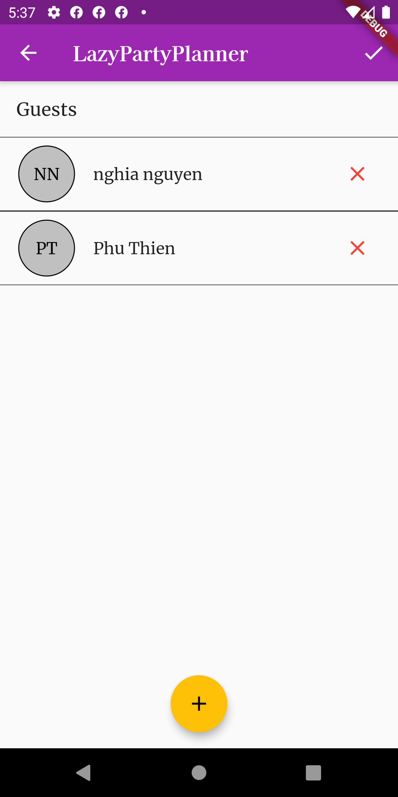

# lazy_party_planner

## Purpose
- This is a second flutter project. It is created to help the user plan a party with ease. In addition, while building the app, a lot of basic concepts has been implemented and improved.
- Having the basic understanding of passing data between screen and app's life cycle

## Screenshots

###### Home Screen

  
  

###### Add/Edit Party Screen

  
  

###### Add/Edit Guest Screen

  
  

